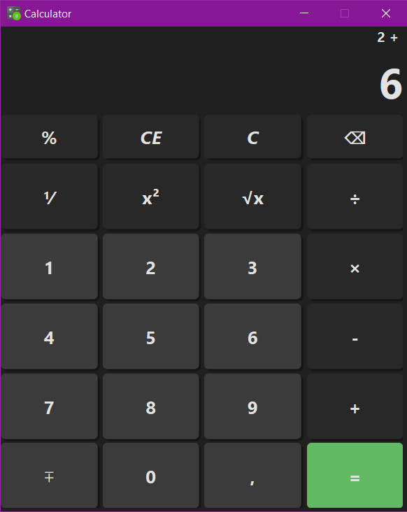

# Simple Calculator

## About

Этот проект представляет собой калькулятор с графическим интерфейсом, разработанный на Python с использованием библиотеки PyQt6. Приложение имитирует стиль стандартного калькулятора Windows, но с урезанным функционалом для сохранения простоты и удобства использования.

<div align="center">
  

  
</div>

### Особенности приложения

- **Элегантный интерфейс** в темной теме, вдохновленный калькулятором Windows
- **Основные математические операции**:
  - Сложение, вычитание, умножение, деление
  - Остаток от деления (%)
  - Обратное значение (1/x)
  - Квадрат числа (x²) и квадратный корень (√x)
  - Смена знака числа (±)
- **Удобное управление**:
  - Подсветка кнопок при наведении и нажатии
  - Четкая визуализация ввода и результатов
  - Анимация взаимодействия
- **Работа с числами**:
  - Поддержка десятичных дробей (через запятую)
  - Удаление последнего символа (⌫)
  - Полная очистка (C) и очистка текущего ввода (CE)

### Интерфейс

Приложение имеет два основных поля отображения:

1. Верхнее поле - показывает текущее выражение
2. Основное поле - отображает текущий ввод/результат вычислений

Кнопки сгруппированы по функциональности:

- **Серые кнопки** - цифры и базовые операции
- **Темно-серые кнопки** - специальные функции
- **Зеленая кнопка** - выполнение вычисления (=)

## Installation

0.  **Клонирование репозитория:**

    Перед тем как начать, вам необходимо клонировать репозиторий с исходным кодом проекта.

    ```bash
    git clone https://github.com/UmbrellaLeaf5/template_python_usual.git
    ```

    Перейдите в директорию, куда был клонирован репозиторий:

    ```bash
    cd template_python_usual
    ```

1.  **Создание виртуального окружения:**

    Откройте терминал или командную строку в корневой директории вашего проекта (там, где находится файл `requirements.txt`) и выполните следующую команду для создания виртуального окружения с именем `.venv`:

    ```bash
    python3 -m venv .venv
    ```

    или

    ```bash
    python -m venv .venv
    ```

    - Если у вас установлена только версия `Python 3`, можете использовать `python` вместо `python3`.
    - Если виртуальное окружение уже существует (вы его создавали ранее), пропустите этот шаг.

2.  **Активация виртуального окружения:**

    Активируйте виртуальное окружение, чтобы `Python` использовал библиотеки, установленные внутри него:

    - **Linux/macOS:**

      ```bash
      source .venv/bin/activate
      ```

    - **Windows (Command Prompt):**

      ```cmd
      .venv\Scripts\activate
      ```

    - **Windows (PowerShell):**

      ```powershell
      .venv\Scripts\Activate.ps1
      ```

    После активации вы увидите `(.venv)` в начале строки терминала, указывающее на то, что виртуальное окружение активно.

3.  **Установка зависимостей из `requirements.txt`:**

    Установите все библиотеки, перечисленные в файле `requirements.txt`, выполнив следующую команду:

    ```bash
    ./.venv/Scripts/pip install -r requirements.txt
    ```

    или просто:

    ```bash
    pip install -r requirements.txt
    ```

**Или просто используйте [`uv`](https://github.com/astral-sh/uv):**

```bash
uv venv .venv
```

- **Linux/macOS:**

  ```bash
  source .venv/bin/activate
  ```

- **Windows (Git Bash):**

  ```bash
  source .venv/Scripts/activate
  ```

- **Windows (Command Prompt):**

  ```cmd
  .venv\Scripts\activate
  ```

- **Windows (PowerShell):**

  ```powershell
  .venv\Scripts\Activate.ps1
  ```

```bash
uv pip install -r requirements.txt
```

P.S. одной строкой:

```bash
uv venv .venv && source .venv/Scripts/activate && uv pip install -r requirements.txt
```
